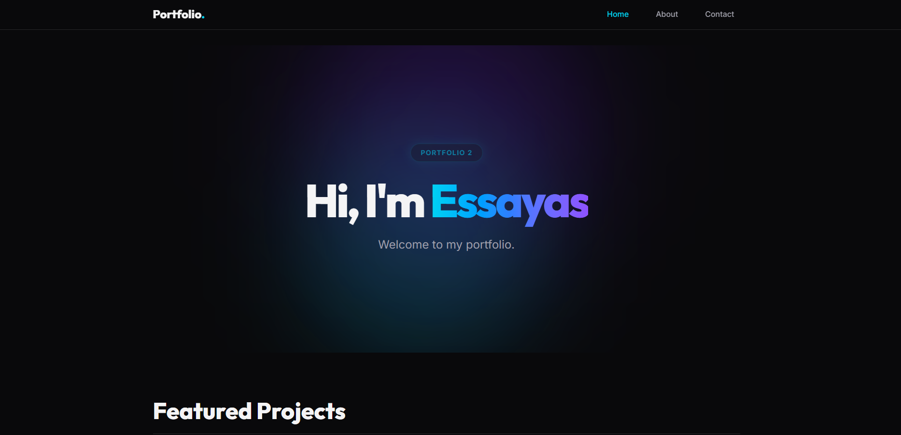

# Portfolio 2



Hi! Welcome to my Portfolio 2. I'm a front-end development student at Noroff, and this is the second iteration of my personal portfolio website.

My first portfolio was built using plain HTML, CSS, and vanilla JavaScript. For this version, I decided to challenge myself and completely rebuild the entire thing using a modern React stack!

## Live Demo

- **Live Site:** (https://portfolio-three-cyan-aoekl0pbrw.vercel.app/)
- **GitHub Repository:** (https://github.com/tedy-abr/portfolio-1)

## What I Built

This is a modern, component-based React application built to showcase the three main projects from my studies.

Some of the cool things I learned and implemented here:

- **React Router:** I used this to create a single-page application so the page doesn't reload when you click around.
- **Dynamic Pages:** Instead of copying and pasting HTML for every project, I put all my project data in one `projects.js` file and used React to dynamically map over it to generate the cards and article pages!
- **Tailwind CSS:** I styled everything using Tailwind CSS v4, focusing on a dark-mode look and making sure it's fully responsive on mobile phones.
- **Interactive UI:** I added a working hamburger menu for mobile and a cool "Copy Link" clipboard button using `lucide-react` icons.

## Built With

- **React** (v19)
- **Vite** (for super fast local development!)
- **React Router**
- **Tailwind CSS** (v4)

## Project Structure

Just a quick look at how I organized my code:

```text
src/
├── components/     # Reusable parts like my Header, Footer, and ProjectCard
├── data/           # Where my projects.js data lives
├── pages/          # The main views (Home, About, Contact, ProjectArticle)
├── App.jsx         # Where all the routing happens
└── index.css       # My Tailwind config and base styles
```

## How to run it locally

If you want to download this code and run it yourself, it's pretty easy:

1. **Clone it:**

   ```bash
   git clone
   ```

2. **Open the folder:**

   ```bash
   cd portfolio-1
   ```

3. **Install the packages:**

   ```bash
   npm install
   ```

4. **Start the local server:**

   ```bash
   npm run dev
   ```

5. **View it:** Open your browser to `http://localhost:5175`!

## About Me

I'm a front-end student currently finishing up my studies at Noroff. I love building responsive, accessible, and good-looking user interfaces. Building this portfolio was a great way to put everything I've learned about React and Tailwind into practice!
